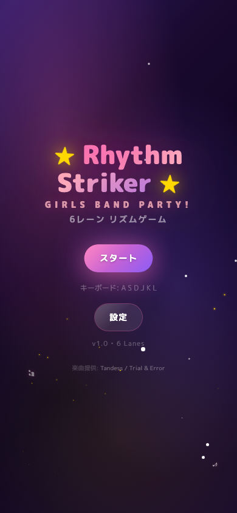
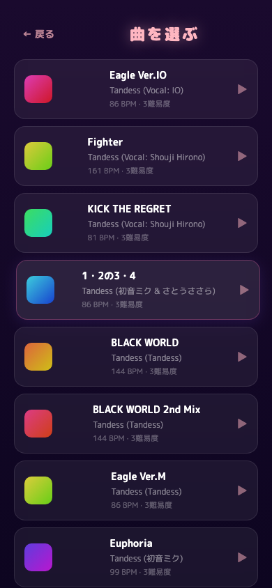
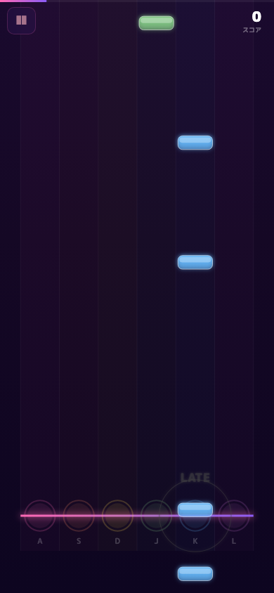

# Rhythm Striker ★ — 7レーン リズムゲーム

ガルパ（バンドリ！）風の7レーン落下型リズムゲーム。ブラウザだけで完結し、サーバー不要・完全オフラインで動作します。130曲×3難易度＝計390譜面を収録。

**[▶ ブラウザで今すぐプレイ](https://toukanno.github.io/rhythm-game-001/)**

<p align="center">
  
  
  
</p>

## 特徴

- **7レーン** ガルパスタイルの落下型プレイ
- **3種ノーツ** — タップ / ロング（ホールド） / フリック
- **5段階判定** — Perfect / Great / Good / Bad / Miss + コンボ & スコア
- **130曲収録** — Easy / Normal / Hard の3難易度（計390譜面）
- **カスタム譜面** — JSON + 音声ファイルを読み込み可能
- **レスポンシブ** — キーボード（デスクトップ）& タッチ（モバイル/タブレット）
- **iOS対応** — Capacitor でネイティブアプリ化可能
- **完全オフライン** — 静的ファイルのみ、サーバー不要

## セットアップ

**必要環境:** Node.js 18+ / npm

```bash
git clone https://github.com/toukanno/rhythm-game-001.git
cd rhythm-game-001
npm install
npm run dev        # → http://localhost:5173
```

### ビルド

```bash
npm run build      # dist/ に本番ビルドを出力
npm run preview    # ビルド結果をローカルでプレビュー
```

### iOS ビルド (Capacitor)

macOS 13+ / Xcode 15+ / Apple Developer アカウントが必要です。

```bash
npm run build:cap       # Capacitor 用ウェブビルド
npm run cap:sync        # iOS プロジェクトに同期
npm run cap:open:ios    # Xcode で開く
```

Xcode で Signing を設定後、Run またはArchive → App Store Connect へ提出できます。

| 項目 | 値 |
|------|-----|
| Bundle ID | `com.toukanno.rhythmstriker` |
| 最小 iOS | 15.0 |
| 画面向き | 縦画面 (ポートレート) |

## 操作方法

### キーボード

| キー | A | S | D | F | J | K | L |
|------|---|---|---|---|---|---|---|
| レーン | 1 | 2 | 3 | 4 | 5 | 6 | 7 |

**ESC** で一時停止 / 設定画面からキーバインド変更可能

### タッチ

画面下部のタップゾーンを直接タッチ。

## カスタム譜面

選曲画面の「カスタム譜面を読み込む」から JSON ファイルを読み込めます。

```json
{
  "title": "曲名",
  "artist": "アーティスト名",
  "difficulty": "HARD",
  "bpm": 120,
  "audioFile": "",
  "offset": 0,
  "notes": [
    { "lane": 3, "time": 1000, "type": "tap" },
    { "lane": 1, "time": 2000, "type": "hold", "duration": 500 },
    { "lane": 5, "time": 3000, "type": "flick" }
  ]
}
```

| フィールド | 説明 |
|-----------|------|
| `lane` | 0〜6（7レーン） |
| `time` | 曲開始からのタイミング (ms) |
| `type` | `"tap"` / `"hold"` / `"flick"` |
| `duration` | ホールド長 (ms) — `hold` のみ |

## 技術スタック

| 技術 | 用途 |
|------|------|
| TypeScript (strict) | 型安全な開発 |
| Vite 8 | ビルド & 開発サーバー |
| HTML5 Canvas | ゲーム描画 |
| Web Audio API | 音声再生 & デモ曲生成 |
| Capacitor 8 | iOS ネイティブアプリ化 |

ランタイム依存なし — ブラウザ API のみで動作します。

## ディレクトリ構成

```
src/
├── main.ts                  # エントリーポイント (画面遷移管理)
├── style.css                # グローバルスタイル
├── engine/
│   ├── types.ts             # 型定義 & 定数
│   ├── game.ts              # ゲームループ & 判定ロジック
│   ├── renderer.ts          # Canvas 描画
│   ├── audio.ts             # Web Audio 管理 & デモ曲生成
│   ├── input.ts             # キーボード & タッチ入力
│   └── keyConfig.ts         # キーバインド設定 (localStorage)
├── screens/
│   ├── title.ts             # タイトル画面
│   ├── songSelect.ts        # 選曲画面
│   ├── gameplay.ts          # プレイ画面
│   ├── results.ts           # リザルト画面
│   └── settings.ts          # キー設定画面
└── beatmaps/
    ├── demo.ts              # デモ譜面生成
    └── customLoader.ts      # カスタム譜面読み込み
```

## 楽曲クレジット

| ソース | 曲数 | クレジット |
|--------|------|-----------|
| [Tandess / Trial & Error](https://www.tandess.com/music/) | 71曲 | 作曲: 阪神 総一 |
| [魔王魂](https://maou.audio/) | 59曲 | 作曲: 森田交一 |

各曲に Easy / Normal / Hard の3難易度を収録（計390譜面）。

## ライセンス

MIT
